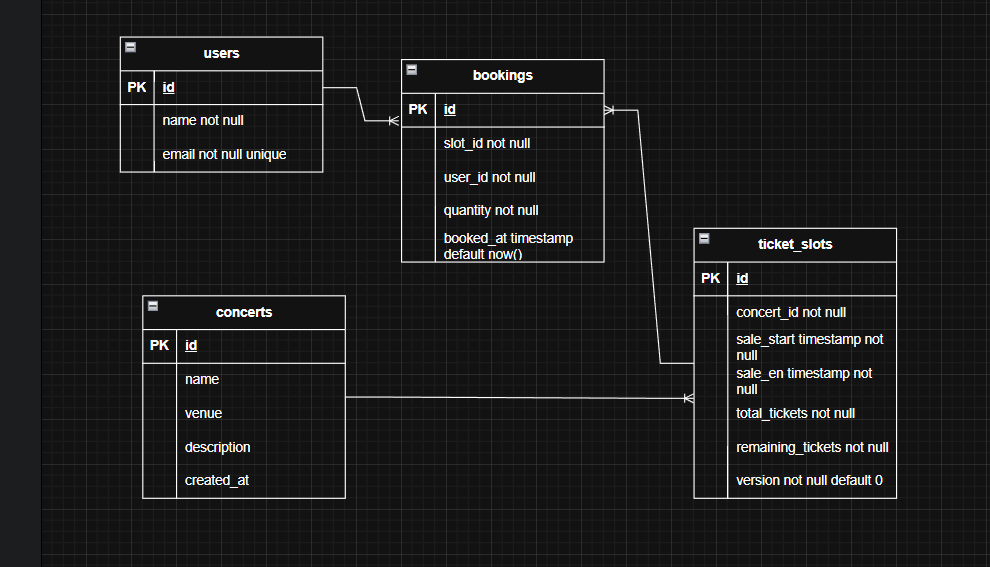

# 🎟️ Concert Ticket Booking System

## 📌 Overview

This project is a **Ticket booking system** that allows users to:

* Search concerts
* View ticket availability
* Book tickets within a limited time window

---

# 🔄 End-to-End Flow

## 1. Create Concert

Admin creates concert with ticket slots

```
Concert → Ticket Slots → Ready for sale
```

---

## 2. Search Concert

User searches concerts

```
User → API → DB → Return list
```

---

## 3. View Ticket Slots

User sees available slots

Only valid if:

```
sale_start <= NOW() <= sale_end
```

---

## 4. Booking Ticket Flow

### Step-by-step:

1. User request booking
2. Validate:

    * time window
    * ticket availability
3. Atomic update ticket
4. Insert booking
5. Commit transaction

---

# 🗄️ Database Design

## ERD



* users → bookings : One-to-Many (1 user can make many bookings)
* ticket_slots → bookings : One-to-Many (1 slot can have many bookings)
* concerts → ticket_slots : One-to-Many (1 concert can have many ticket slots)


---

## Tables Explanation

The database is designed to ensure performance, scalability, and data consistency under high concurrency.

* users stores user identity with email unique to prevent duplicates.
* concerts stores concert data and is separated from ticket logic to allow flexible ticket sale phases.
* ticket_slots is the core table that manages ticket sales, including time window, stock, and concurrency control.
* separated from concerts → supports multiple sale phases (pre sale, general sale, etc.)
* remaining_tickets → avoids expensive count queries for better performance
* version → enables optimistic locking to prevent overselling during concurrent booking
* bookings stores user transactions with unique (slot_id, user_id) to prevent duplicate bookings per user

# 📡 API Documentation

Base URL:

```
http://localhost:9090/v1/api
```

---

##  API

```
PLEASE CHECK FOLDER POSTMAN -> COLLECTION
AFTER YOU FIND THE FOLDER, OPEN THE POSTMAN AND CLICK BUTTON IMPORT AND CHOOSE COLLECTION.JSON
```


---

## 2. Run application

```
./mvnw spring-boot:run
```

---

## 3. Build

```
mvn clean install
```

---


